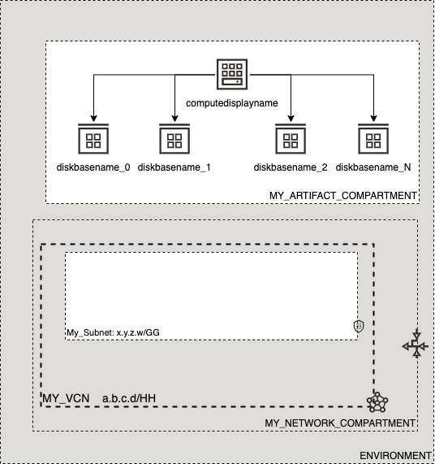

# OCI Cloud Bricks: iSCSI Disks (Linux)

[](https://img.shields.io/badge/license-UPL-green) [](https://sonarcloud.io/dashboard?id=oracle-devrel_terraform-oci-cloudbricks-linux-iscsi-disks)

## Introduction
The following cloud brick enables you to create batches of iscsi disks associated to a specific IaaS Linux Compute

## Reference Architecture
The following is the reference architecture associated to the brick




### Prerequisites
- This module needs to be used associated with a Linux Compute IaC Creation, as it depends on variable `compute_availability_domain_list` which needs to be pre-defined. 
- Linux Compute Distributions currently supported under this module are: 
  - CentOS 6.x
  - CentOS 7.x 
  - CentOs 8.x
  - Oracle Autonomous Linux 7.x
  - Oracle Linux 6.x
  - Oracle Linux 7.x
  - Oracle Linux 8.x
  - Custom images based on RHEL
  - Ubuntu
  
---  

## Sample tfvar file

```shell
########## SAMPLE TFVAR FILE ##########
########## PROVIDER SPECIFIC VARIABLES ##########
region           = "foo-region-1"
tenancy_ocid     = "ocid1.tenancy.oc1..abcdefg"
user_ocid        = "ocid1.user.oc1..aaaaaaabcdefg"
fingerprint      = "fo:oo:ba:ar:ba:ar"
private_key_path = "/absolute/path/to/api/key/your_api_key.pem"
########## PROVIDER SPECIFIC VARIABLES ##########

########## ARTIFACT SPECIFIC VARIABLES ##########
amount_of_disks                      = "2"
disk_size_in_gb                      = "50"
iscsi_disk_instance_compartment_name = "MY_ARTIFACT_COMPARTMENT"
volume_display_name                  = "diskbasename"
backup_policy_level                  = "gold"
is_opc                               = false
########## ARTIFACT SPECIFIC VARIABLES ##########
########## SAMPLE TFVAR FILE ##########
```

## Variable specific considerations
- Variable `amount_of_disks` represents the number of disks being created. This has to be a minimum of 1
- Minimum disk size is 50GB
- Variable `iscsi_disk_instance_compartment_name` refers to the compartment where this artifact will be associated/created into
- Variable `volume_display_name` represents the base name of the disk. This will be later concatenated with the amount of disks given by variable `amount_of_disks` and the name of the associated instance, being something like `computedisplayname_diskbasename_0_`, `computedisplayname_diskbasename_1`, `computedisplayname_diskbasename_N` where `N` will match the variable  
- Variable `backup_policy_level` associates the backup policy level given to the disks. By default `bronze`, `silver` and `gold` are available, however this also supports custom policies. This variable will take the name of such policy and apply it to disk  
- If Disk is provisioned decoupled from Compute, in a different run, the following extra entries are required on tfvars file: 

```shell
compute_availability_domain_list = ["aBCD:foo-REGION-1-AD-X" ]
compute_display_name             = "DISPLAY_NAME_OF_ASSOCIATED_INSTANCE"
linux_compute_id                 = "OCID_OF_ASSOCIATED_INSTANCE"
linux_compute_private_ip         = "PRIVATE_IP_OF_INSTANCE"
ssh_private_key                  = "PRIVATE_SSH_KEY_OF_INSTANCE"
```
*Special Considerations*
- The above described variables have the following purpose
  - `compute_availability_domain_list`: This is the exact AD where the Linux Instance got created. A single entry is required here
  - `compute_display_name`: The display name given to the Linux Instance
  - `linux_compute_id`: The OCID associated to the Linux Instance
  - `ssh_private_key`: The SSH Private Key associated to the created Linux Instance

---

## Sample provider
The following is the base provider definition to be used with this module

```shell
terraform {
  required_version = ">= 0.13.5"
}
provider "oci" {
  region       = var.region
  tenancy_ocid = var.tenancy_ocid
  user_ocid        = var.user_ocid
  fingerprint      = var.fingerprint
  private_key_path = var.private_key_path
  disable_auto_retries = "true"
}

provider "oci" {
  alias        = "home"
  region       = data.oci_identity_region_subscriptions.home_region_subscriptions.region_subscriptions[0].region_name
  tenancy_ocid = var.tenancy_ocid  
  user_ocid        = var.user_ocid
  fingerprint      = var.fingerprint
  private_key_path = var.private_key_path
  disable_auto_retries = "true"
}
```

---
## Variable documentation
## Requirements

| Name | Version |
|------|---------|
| <a name="requirement_terraform"></a> [terraform](#requirement\_terraform) | >= 0.13.5 |

## Providers

| Name | Version |
|------|---------|
| <a name="provider_null"></a> [null](#provider\_null) | 3.1.0 |
| <a name="provider_oci"></a> [oci](#provider\_oci) | 4.36.0 |

## Modules

No modules.

## Resources

| Name | Type |
|------|------|
| [null_resource.format_disk_exec](https://registry.terraform.io/providers/hashicorp/null/latest/docs/resources/resource) | resource |
| [null_resource.mount_disk_exec](https://registry.terraform.io/providers/hashicorp/null/latest/docs/resources/resource) | resource |
| [null_resource.partition_disk](https://registry.terraform.io/providers/hashicorp/null/latest/docs/resources/resource) | resource |
| [null_resource.provisioning_disk](https://registry.terraform.io/providers/hashicorp/null/latest/docs/resources/resource) | resource |
| [null_resource.pvcreate_exec](https://registry.terraform.io/providers/hashicorp/null/latest/docs/resources/resource) | resource |
| [null_resource.vgcreate_exec](https://registry.terraform.io/providers/hashicorp/null/latest/docs/resources/resource) | resource |
| [oci_core_volume.ISCSIDisk](https://registry.terraform.io/providers/hashicorp/oci/latest/docs/resources/core_volume) | resource |
| [oci_core_volume_attachment.ISCSIDiskAttachment](https://registry.terraform.io/providers/hashicorp/oci/latest/docs/resources/core_volume_attachment) | resource |
| [oci_core_volume_backup_policy_assignment.backup_policy_assignment_ISCSI_Disk](https://registry.terraform.io/providers/hashicorp/oci/latest/docs/resources/core_volume_backup_policy_assignment) | resource |
| [oci_core_volume_backup_policies.BACKUPPOLICYISCSI](https://registry.terraform.io/providers/hashicorp/oci/latest/docs/data-sources/core_volume_backup_policies) | data source |
| [oci_identity_compartments.COMPARTMENTS](https://registry.terraform.io/providers/hashicorp/oci/latest/docs/data-sources/identity_compartments) | data source |

## Inputs

| Name | Description | Type | Default | Required |
|------|-------------|------|---------|:--------:|
| <a name="input_amount_of_disks"></a> [amount\_of\_disks](#input\_amount\_of\_disks) | Amount of equally sized disks | `any` | n/a | yes |
| <a name="input_attach_disks"></a> [attach\_disks](#input\_attach\_disks) | Atach disk to a Linux instance | `bool` | `true` | no |
| <a name="input_attachment_type"></a> [attachment\_type](#input\_attachment\_type) | Atacchment type can be iscsi or paravirtualized | `string` | `"iscsi"` | no |
| <a name="input_backup_policy_level"></a> [backup\_policy\_level](#input\_backup\_policy\_level) | Backup policy level for ISCSI disks | `any` | n/a | yes |
| <a name="input_compute_availability_domain_list"></a> [compute\_availability\_domain\_list](#input\_compute\_availability\_domain\_list) | Availability Domain where the block storage will be created at | `any` | n/a | yes |
| <a name="input_compute_display_name"></a> [compute\_display\_name](#input\_compute\_display\_name) | Name of the compute where the disk will be attached to | `any` | n/a | yes |
| <a name="input_disk_size_in_gb"></a> [disk\_size\_in\_gb](#input\_disk\_size\_in\_gb) | Size in GB for Product Disk | `any` | n/a | yes |
| <a name="input_fingerprint"></a> [fingerprint](#input\_fingerprint) | API Key Fingerprint for user\_ocid derived from public API Key imported in OCI User config | `any` | n/a | yes |
| <a name="input_is_opc"></a> [is\_opc](#input\_is\_opc) | Describes if user to use is opc or not. Setting this to false, will default to ubuntu user | `bool` | `true` | no |
| <a name="input_iscsi_disk_instance_compartment_name"></a> [iscsi\_disk\_instance\_compartment\_name](#input\_iscsi\_disk\_instance\_compartment\_name) | Defines the compartment name where the infrastructure will be created | `any` | n/a | yes |
| <a name="input_linux_compute_id"></a> [linux\_compute\_id](#input\_linux\_compute\_id) | OCI Id for instance to attach the disk | `any` | `null` | no |
| <a name="input_linux_compute_private_ip"></a> [linux\_compute\_private\_ip](#input\_linux\_compute\_private\_ip) | Compute private IP to logon into machine | `any` | n/a | yes |
| <a name="input_private_key_path"></a> [private\_key\_path](#input\_private\_key\_path) | Private Key Absolute path location where terraform is executed | `any` | n/a | yes |
| <a name="input_region"></a> [region](#input\_region) | Target region where artifacts are going to be created | `any` | n/a | yes |
| <a name="input_ssh_private_is_path"></a> [ssh\_private\_is\_path](#input\_ssh\_private\_is\_path) | Determines if key is supposed to be on file or in text | `bool` | `true` | no |
| <a name="input_ssh_private_key"></a> [ssh\_private\_key](#input\_ssh\_private\_key) | Determines what is the private key to connect to machine | `any` | n/a | yes |
| <a name="input_tenancy_ocid"></a> [tenancy\_ocid](#input\_tenancy\_ocid) | OCID of tenancy | `any` | n/a | yes |
| <a name="input_user_ocid"></a> [user\_ocid](#input\_user\_ocid) | User OCID in tenancy. | `any` | n/a | yes |
| <a name="input_volume_display_name"></a> [volume\_display\_name](#input\_volume\_display\_name) | Disk display name. | `any` | n/a | yes |
| <a name="input_vpus_per_gb"></a> [vpus\_per\_gb](#input\_vpus\_per\_gb) | n/a | `number` | `10` | no |

## Outputs

| Name | Description |
|------|-------------|
| <a name="output_core_volumens"></a> [core\_volumens](#output\_core\_volumens) | n/a |
| <a name="output_core_volumens_attachment"></a> [core\_volumens\_attachment](#output\_core\_volumens\_attachment) | n/a |
| <a name="output_volumen_ids"></a> [volumen\_ids](#output\_volumen\_ids) | n/a |

## Contributing
This project is open source.  Please submit your contributions by forking this repository and submitting a pull request!  Oracle appreciates any contributions that are made by the open source community.

## License
Copyright (c) 2021 Oracle and/or its affiliates.

Licensed under the Universal Permissive License (UPL), Version 1.0.

See [LICENSE](LICENSE) for more details.
